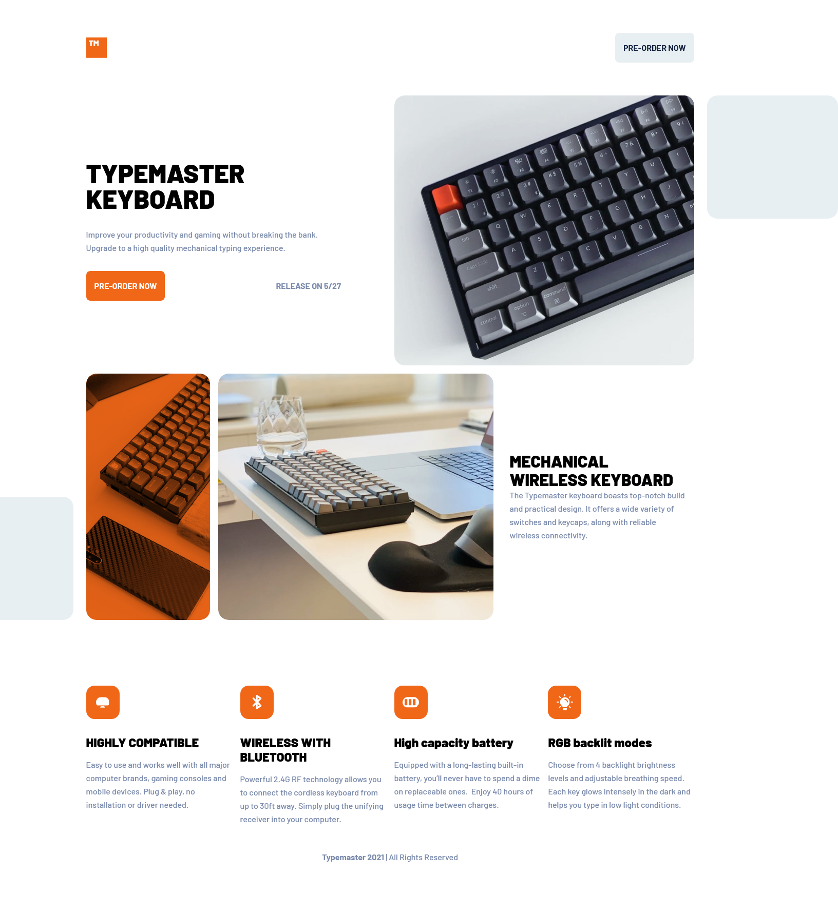

# Frontend Mentor - Typemaster pre-launch landing page solution

This is a solution to the [Typemaster pre-launch landing page challenge on Frontend Mentor](). Frontend Mentor challenges help you improve your coding skills by building realistic projects.

## Table of contents

  - [Overview](#overview)
    - [The challenge](#the-challenge)
    - [Screenshot](#screenshot)
    - [Links](#links)
  - [My process](#my-process)
    - [Built with](#built-with)
    - [What I learned](#what-i-learned)
  - [Author](#author)
  - [Acknowledgments](#acknowledgments)


## Overview

### The challenge

Mobile-first design.

### Screenshot



### Links

- Solution URL: [Solution](https://www.frontendmentor.io/solutions/keyboard-landing-page-with-scss-wWbWu8ncp)
- Live Site URL: [Github page](https://suleeyman.github.io/FM-1-Keyboard-Landing-Page/)

## My process

First of all, I've used the mobile-first method. then I've implemented breakpoints for Tablet/Desktop design.
Then I created a display grid on the main content and the image gallery.

### Built with

- Semantic HTML5 markup
- CSS custom properties
- Flexbox
- CSS Grid
- Mobile-first workflow

### What I learned

I've learned about `<picture>` element. And to be honest, I've spend 5hours for finding this best solution for responsive images. I've tried
the  `srcset` on an unique ``, but I've failed. Then I used this one:

```html
<picture>
    <source media="(min-width: 700px) and (max-width: 1000px)" srcset="assets/tablet/image-phone-and-keyboard.jpg">
    <source media="(min-width: 1001px)" srcset="assets/desktop/image-phone-and-keyboard.jpg">
    
</picture>
```
And mix-blend-mode for the orange image. This property, uses the background-color of his parent element to combine for his image.
```css
img {
  mix-blend-mode: multiply;
}
```
Moreover, I've learned how to create basic SCSS folder with @use and @forward.
And finally, how to create a .md file and how to host my repository.
```scss
@forward "mixins";
@forward "variables";
@forward "global";
```

## Author

- Frontend Mentor - [@Suleeyman](https://www.frontendmentor.io/profile/Suleeyman)